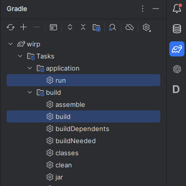

# Помощник в написании и исправлении модов для сервера "What If...?" (Project Zomboid)

### Требования:
* Intellij Idea
* Java 17
* Исходники модов
* Установленный PZ


    Для начала воспользуемся проектом для генерации jar исходников PZ https://github.com/Konijima/PZ-Libraries.<br>
По инструкции получаем нужные нам два jar файла: _zdoc-lua.jar_ (.lua) и _zomboid.jar_ (.classes) — , содержащие lua и java из нужной нам верссии PZ.<br>
`При обновлении PZ их нужно перекомпилировать!`<br>
Эти файлы требуется переложить в папку lib проекта, если надо — заменить имеющиеся. <br>

---

Исходники самих модов кладутся в папку _src/main/resources/mods/_<br>
Далее нужно прописать путь к скрипту мода, который мы хотим изменять, в настроечном файле: _config.properties_ (_src/main/resources/config.properties_).<br>
Например: `SCRIPT=mods/*папка_с_модом*/media/lua/server/*название_скрипта*.lua`

Выполнить _gradle build_, потом — _gradle run_ (запуск проверки кода)


### Пример
Запустим lua из мода Prisoner, указав путь в _config.properties_ <br>
`SCRIPT=mods/Prisonner/media/lua/server/BP_Moddata_Server.lua` <br><br>
Получим лог: `19:21:33.730 [main] ERROR org.wirp.LuaFileRun -- Error running script: mock status OK, script status RUNTIME`<br>
Программа отработала, но мы получили сообщение, что скрипт неисправен. <br>
Это не означает, что скрипт не работает, давайте сократим содержимое скрипта до:

````
if isClient() then return; end;

playerdataServer = {};
playerdataServer.Verbose = false
--[[--======== Players ========--
]]--
````
Ошибка заключалась в том, что код использует функцию _isClient()_, которая определает является ли игрок клиентом.
В проекте есть файл: _src/main/resources/mods/Mock.lua_, который поможет нам сделать заглушку на данном вызове функции.<br>
Внесем в него следующие правки и попробуем запустить:
````
function isClient()
    return false
end
````
Получаем лог: `19:35:06.108 [main] DEBUG org.wirp.LuaFileRun -- Script done`
Он означает, что мы успешно имитировали сервер.<br>
Далее все моки будут добавлены по аналогии, когда потребуется. _To be continued..._

Если получено сообщение: <br>
`19:39:33.990 [main] ERROR org.wirp.LuaFileRun -- Error running script: mock status RUNTIME, script status RUNTIME` <br>
Ошибка находится в самом файле моков. <br>

FIX: Следует добавить полный stacktrace ошибок
